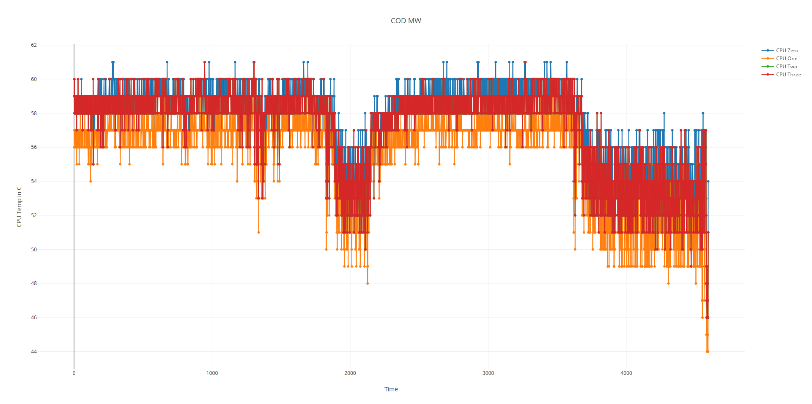

# Hardware-Graph
This program allows users to graph different parameters (core temperature, clock speed etc) of a users computer hardware from the csv file produced by Open Hardware Monitor monitor.

### Prerequisite 
- Plotly
- Pandas

#### Screenshots
